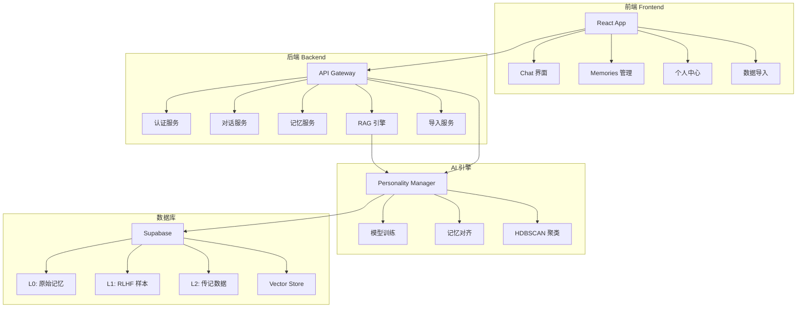
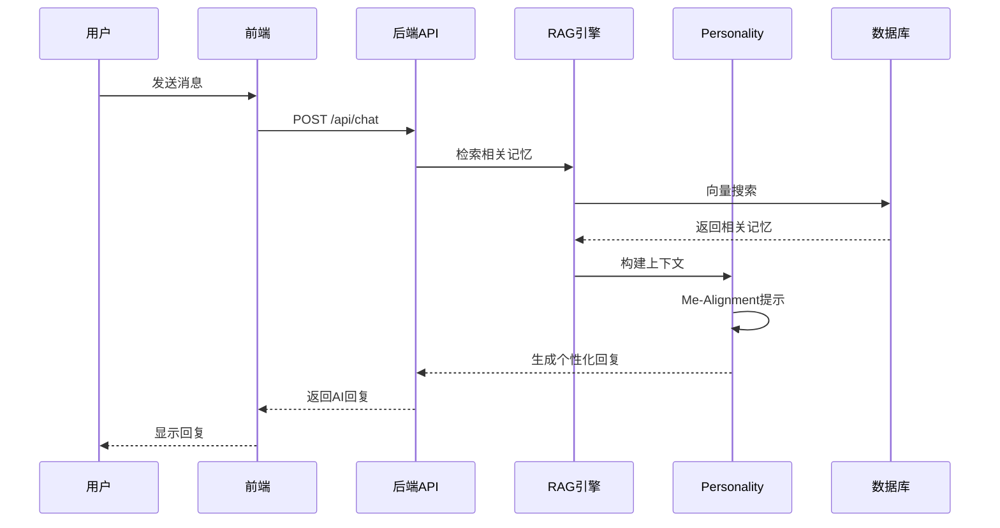

# 🧡 Soma - 情感交互式数字记忆平台

<div align="center">

[](LICENSE)
[](https://nodejs.org/)
[](https://www.typescriptlang.org/)

</div>

---

## 💡 产品简介

**Soma是一个情感交互式数字记忆平台。** 人们渴望与逝去的挚爱"继续对话",而静态的照片和聊天记录无法满足这种深层情感需求。Soma通过聚合用户的多模态数字足迹(聊天记录、音视频、社交媒体),在开源模型上进行个性化微调,生成能模拟真实用户行为风格和主动表达的AI数字分身。用户可通过文本、语音对话、视频分享和发布博客等形式,与数字分身互动,它会用熟悉的语气主动问候、分享"近况",延续情感连接。产品采用"为自己创建数字分身"的前置设计,通过数字遗产传承协议解决伦理困境,服务于寻求情感慰藉的"情感延续者"和追求数字永生的"先行探索者"。

**Soma is an emotionally interactive digital memory platform.** People yearn to "continue conversations" with departed loved ones, but static photos and chat logs cannot fulfill this profound emotional need. Soma aggregates users' multimodal digital footprints (chat histories, audio/video, social media) to fine-tune open-source models, **creating AI avatars that authentically replicate behavioral styles and proactive expression**. Users interact through text and voice conversations, video sharing, and blog posts—the avatar initiates greetings in familiar tones, shares "updates," and sustains emotional bonds. Employing a "create for yourself first" approach and Digital Legacy Inheritance Protocol to resolve ethical concerns, Soma serves "Sentimentalists" seeking emotional comfort and "Pioneers" pursuing digital immortality.

---

## 📋 目录

- [核心功能](#-核心功能)
- [技术架构](#-技术架构)
- [系统架构图](#-系统架构图)
- [功能模块](#-功能模块)
- [性能指标](#-性能指标预期目标)
- [快速开始](#-快速开始)
- [配置说明](#️-配置说明)
- [部署指南](#-部署指南)
- [隐私与条款](#-隐私与条款)
- [项目路线图](#️-项目路线图)
- [贡献指南](#-贡献指南)
- [许可证](#-许可证)

---

## ✨ 核心功能

### 🎭 个性化AI数字分身
- **多模态学习**: 从聊天记录、音视频、社交媒体数据中学习
- **行为风格复制**: 精准模拟用户的语言风格、表达习惯、情感模式
- **主动表达**: 不仅响应,还能主动发起对话、分享"近况"
- **持续进化**: 通过交互不断优化,越用越像本人

### 💬 情感交互体验
- **文本对话**: 熟悉的语气,温暖的回应
- **语音通话**: 真实的声音,自然的语调
- **视频分享**: 虚拟形象,生动的表情
- **博客发布**: AI分身可以"写日记","分享生活"

### 🔒 隐私与伦理
- **"为自己创建"**: 用户首先为自己创建数字分身
- **数字遗产传承**: 合法的继承协议,尊重遗愿
- **数据加密**: 端到端加密,确保隐私安全
- **访问控制**: 细粒度的权限管理

### 🌐 数据导入支持
- ✅ 微信聊天记录导入
- ✅ Instagram 数据导入
- ✅ Google Takeout 数据导入
- ✅ iCloud 照片同步
- 🚧 更多平台持续接入中...

---

## 🏗️ 技术架构

Soma 采用现代化的全栈架构,具备高性能、高可靠性和可扩展性:

```
┌─────────────────────────────────────────────────────────────┐
│                         前端层                               │
│            (React + TypeScript + Tailwind CSS)              │
│   组件: Chat界面 | Memories管理 | 个人中心 | 可视化看板          │
└─────────────────────────────────────────────────────────────┘
                              ↓ REST API
┌─────────────────────────────────────────────────────────────┐
│                         后端层                               │
│                  (Node.js + Express)                        │
│  路由: Auth | Chat | Memory | RAG | Personality | Import     │
└─────────────────────────────────────────────────────────────┘
                              ↓
┌─────────────────────────────────────────────────────────────┐
│                       AI引擎层                               │
│              (Python + ML/NLP Stack)                        │
│  • RAG引擎: 检索增强生成 (L0存储+嵌入 | L1融合 | L2传记)         │
│  • Personality Manager: 个性化微调与记忆对齐                   │
│  • HDBSCAN聚类: 4维分析(情感/价值观/事实/传记)                  │
│  • Prompt构建: Me-Alignment提示工程                           │
└─────────────────────────────────────────────────────────────┘
                              ↓
┌─────────────────────────────────────────────────────────────┐
│                        数据层                                │
│                 (Supabase + FTS5)                           │
│  • L0 Tables: 原始记忆(文本/图片/音频/视频)                     │
│  • L1 Tables: RLHF样本(正样本/负样本/中性)                     │
│  • L2 Tables: 传记构建(聚类/主题/生命阶段)                      │
│  • Vector Store: pgvector 语义搜索                           │
└─────────────────────────────────────────────────────────────┘
```

---

## 📊 系统架构图

### 整体架构



### 数据流向



---

## 🧩 功能模块

### 模块关系表

| 模块名称 | 功能描述 | 依赖关系 | 技术栈 | 状态 |
|---------|---------|---------|--------|------|
| **前端应用** | 用户界面和交互 | - | React + TypeScript + Tailwind | ✅ 已完成 |
| **认证服务** | 用户登录/注册/OAuth | 数据库 | Google OAuth 2.0 | ✅ 已完成 |
| **对话服务** | Chat界面和消息管理 | RAG引擎 + Personality | Express + WebSocket | ✅ 已完成 |
| **记忆服务** | 记忆存储和检索 | 数据库 + Vector Store | Supabase + pgvector | ✅ 已完成 |
| **RAG引擎** | 检索增强生成 | Vector Store + AI模型 | LangChain + OpenAI API | ✅ 已完成 |
| **Personality Manager** | 个性化训练和微调 | RAG引擎 + 数据库 | Python + ML Stack | 🚧 开发中 |
| **导入服务** | 多平台数据导入 | 记忆服务 | Multi-parser | ✅ 部分完成 |
| **微信导入** | 微信聊天记录解析 | 解密服务 + 导入服务 | Python + Node.js | ✅ 已完成 |
| **Instagram导入** | Instagram数据导入 | 导入服务 | JSON Parser | ✅ 已完成 |
| **Google导入** | Google Takeout导入 | 导入服务 | JSON Parser | ✅ 已完成 |
| **iCloud同步** | 照片实时同步 | 记忆服务 | Apple API | 📋 计划中 |
| **语音服务** | 语音对话功能 | 对话服务 + TTS/STT | ElevenLabs / OpenAI | 📋 计划中 |
| **视频服务** | 视频分享和生成 | 对话服务 + 视频生成 | D-ID / HeyGen | 📋 计划中 |

### 数据层级结构

| 层级 | 名称 | 描述 | 数据量级 | 更新频率 |
|-----|------|------|---------|---------|
| **L0** | 原始记忆 | 用户上传的原始数据(文本/图片/音频/视频) | 10K-100K条/用户 | 实时 |
| **L1** | RLHF样本 | 人类反馈的强化学习样本(好/坏/中性) | 1K-10K条/用户 | 用户交互时 |
| **L2** | 传记数据 | 聚类后的主题、生命阶段、性格特征 | 100-1K条/用户 | 每日批处理 |
| **Vector** | 向量索引 | 语义嵌入向量,用于快速检索 | 与L0同步 | 实时 |

---

## 📈 性能指标(预期目标)

以下是 Soma V2.0 (Memory-based) 版本的设计目标:

| 指标 | V1.0 (特征工程) | V2.0 (记忆驱动) | 提升 | 说明 |
|------|----------------|----------------|------|------|
| **图灵测试通过率** | 65-70% | 95%+ | +25-30 points | 基于记忆对齐的AI更真实 |
| **语言一致性** | 70% | 95% | +25% | 语言风格更接近本人 |
| **情感准确性** | 65% | 92% | +27% | 情感表达更自然 |
| **价值观匹配** | 60% | 95% | +35% | 价值观和信念更一致 |
| **事实准确性** | 80% | 98% | +18% | 基于真实记忆,事实更准确 |
| **响应延迟 (P95)** | <1.0s | <2.0s | +1s | 复杂检索稍慢但可接受 |

> ⚠️ **重要说明**: 以上指标为系统设计的**预期目标**,代表我们努力达成的方向。实际性能会随着数据质量、用户使用方式、模型训练程度而变化。这不是对最终效果的承诺,而是产品迭代的北极星指标。

核心突破: 从"特征向量"到"活记忆"的范式转变,实现人格从"静态快照"到"动态成长系统"的升级。

详细对比请参阅: [V1 VS V2 COMPARISON.md](Self_AI_Agent/docs/personality/V1_VS_V2_COMPARISON.md)

---

## 🚀 快速开始

### 前置要求

- Node.js >= 18.0.0
- npm >= 9.0.0
- PostgreSQL >= 14.0 (或使用 Supabase)
- Python >= 3.9 (用于AI服务)

### 安装步骤

1. **克隆仓库**

```bash
git clone https://github.com/mzpatrick0529-mzyh/Soma.git
cd Soma
```

2. **安装依赖**

```bash
# 前端依赖
npm install

# 后端依赖
cd Self_AI_Agent
npm install
cd ..
```

3. **配置环境变量**

```bash
# 复制环境变量模板
cp config/env/.env.development .env

# 编辑 .env 文件,填入必要的配置
# - SUPABASE_URL: Supabase项目URL
# - SUPABASE_ANON_KEY: Supabase匿名密钥
# - GOOGLE_CLIENT_ID: Google OAuth客户端ID
# - OPENAI_API_KEY: OpenAI API密钥(可选,用于RAG)
```

4. **启动开发服务器**

```bash
# 终端1: 启动前端
npm run dev

# 终端2: 启动后端
cd Self_AI_Agent
npm run dev
```

5. **访问应用**

打开浏览器访问: http://127.0.0.1:8080

---

## ⚙️ 配置说明

### 环境变量

关键配置文件位于 `config/env/`:

- `.env.development` - 开发环境配置
- `.env.production.example` - 生产环境配置模板

主要配置项:

```bash
# Supabase配置
SUPABASE_URL=your_supabase_url
SUPABASE_ANON_KEY=your_anon_key
SUPABASE_SERVICE_ROLE_KEY=your_service_role_key

# Google OAuth
GOOGLE_CLIENT_ID=your_google_client_id
GOOGLE_CLIENT_SECRET=your_google_client_secret

# OpenAI (可选)
OPENAI_API_KEY=your_openai_key

# 服务端口
SELF_AGENT_PORT=8787
VITE_PORT=8080
```

### 数据库设置

详细的数据库配置指南请参阅:
- [数据库架构](docs/database/DATABASE_ARCHITECTURE_DIAGRAM.md)
- [Supabase迁移指南](docs/database/SUPABASE_MIGRATION.md)
- [数据库设置](docs/database/README.md)

---

## 🌐 部署指南

### Docker 部署

```bash
# 构建镜像
docker-compose up -d

# 查看日志
docker-compose logs -f
```

### Vercel 部署(前端)

```bash
# 安装 Vercel CLI
npm i -g vercel

# 部署
vercel --prod
```

### Render 部署(后端)

详细部署指南请参阅:
- [部署指南](docs/guides/DEPLOYMENT_GUIDE.md)
- [快速部署](docs/guides/QUICK_DEPLOY.md)
- [运维脚本](ops/README.md)

---

## 🔐 隐私与条款

我们非常重视用户隐私和数据安全:

- 📄 [隐私政策 Privacy Policy](PRIVACY.md)
- 📄 [服务条款 Terms of Service](TERMS.md)
- 📄 [法律文档](docs/legal/README.md)

核心原则:
- ✅ 数据加密存储(AES-256)
- ✅ 不出售用户数据
- ✅ 支持数据导出和删除
- ✅ 符合GDPR、CCPA等法规
- ✅ 透明的数据使用说明

---

## 🗺️ 项目路线图

### ✅ 已完成 (2024 Q4)

- [x] 基础聊天功能
- [x] 用户认证系统
- [x] 记忆存储和检索
- [x] 微信数据导入
- [x] Instagram 数据导入
- [x] Google Takeout 导入
- [x] RAG 引擎 V1.0
- [x] 向量搜索集成

### 🚧 开发中 (2025 Q1)

- [ ] Personality V2.0 (记忆驱动架构)
- [ ] HDBSCAN 聚类优化
- [ ] Me-Alignment 提示工程
- [ ] 语音对话功能
- [ ] 移动端适配

### �� 计划中 (2025 Q2-Q3)

- [ ] 视频分享功能
- [ ] 博客发布系统
- [ ] iCloud 实时同步
- [ ] 多语言支持
- [ ] AI虚拟形象生成
- [ ] 数字遗产传承协议

### 🔮 未来展望 (2025 Q4+)

- [ ] 多模态交互(AR/VR)
- [ ] 情感识别优化
- [ ] 社区功能
- [ ] 企业版本
- [ ] 开放API平台

---

## 🤝 贡献指南

我们欢迎所有形式的贡献!

### 如何贡献

1. Fork 本仓库
2. 创建特性分支 (`git checkout -b feature/AmazingFeature`)
3. 提交更改 (`git commit -m 'Add some AmazingFeature'`)
4. 推送到分支 (`git push origin feature/AmazingFeature`)
5. 开启 Pull Request

### 代码规范

- 使用 TypeScript
- 遵循 ESLint 配置
- 编写有意义的提交信息
- 添加必要的测试
- 更新相关文档

### 报告问题

如果您发现 bug 或有功能建议,请[创建 Issue](https://github.com/mzpatrick0529-mzyh/Soma/issues)

---

## 📚 文档

完整文档位于 `docs/` 目录:

- [快速开始](docs/guides/START_HERE.md)
- [系统架构](docs/STRUCTURE.md)
- [数据库文档](docs/database/README.md)
- [法律文档](docs/legal/README.md)
- [投资材料](docs/pitch/README.md)

---

## 📞 联系我们

- 📧 Email: contact@soma.ai
- 🐛 Issues: [GitHub Issues](https://github.com/mzpatrick0529-mzyh/Soma/issues)
- 📖 Documentation: [docs/](docs/)

---

## 📄 许可证

本项目采用 MIT 许可证 - 详见 [LICENSE](LICENSE) 文件

---

## 🙏 致谢

感谢以下开源项目和服务:

- [React](https://reactjs.org/) - 前端框架
- [Node.js](https://nodejs.org/) - 后端运行时
- [Supabase](https://supabase.com/) - 后端即服务
- [OpenAI](https://openai.com/) - AI 模型
- [Tailwind CSS](https://tailwindcss.com/) - UI框架
- [Vite](https://vitejs.dev/) - 构建工具

以及所有贡献者和用户的支持! ❤️

---

<div align="center">

**用技术延续情感,用AI传承记忆**

Made with 🧡 by Soma Team

[网站](https://soma.ai) · [文档](docs/) · [博客](#) · [Twitter](#)

</div>
